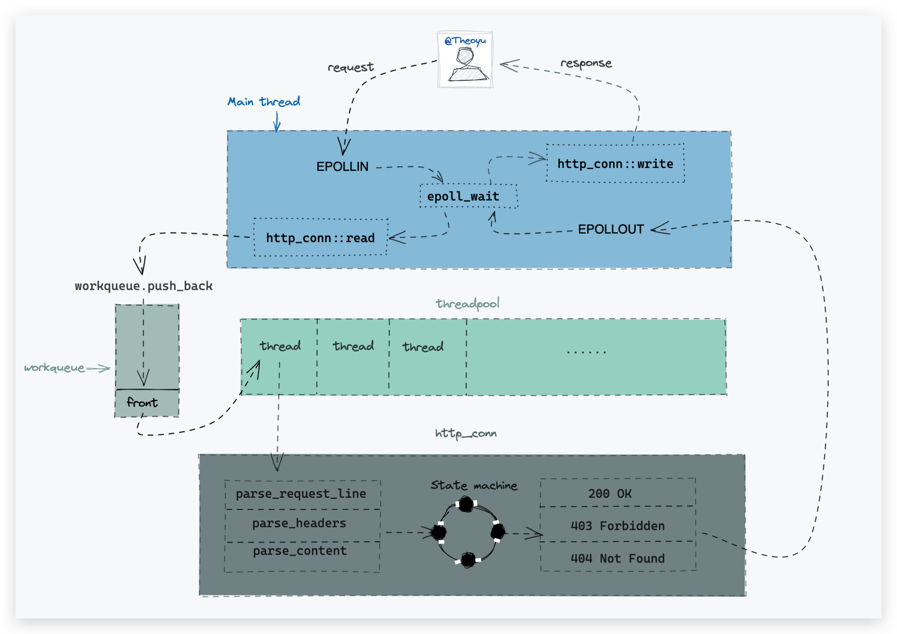
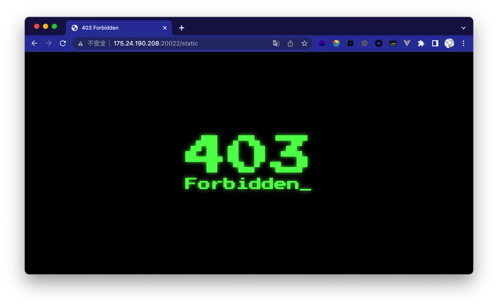
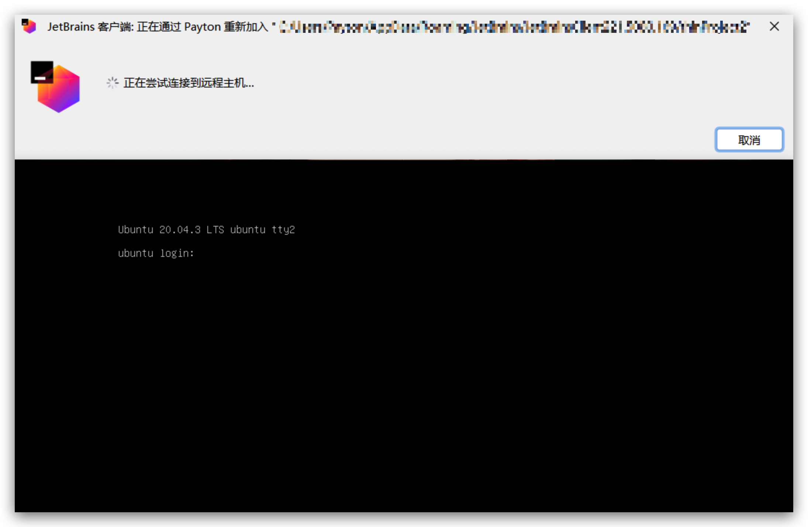

# BabyWebServer
Study project for 《Linux高性能服务器编程》

## 整体逻辑

## 演示

200 OK：

404 Not Found：

403 Forbidden：

403 Forbidden

当然上面都是次要的🤪，随便摸了几个页面而已，只支持GET也没啥好演示的。

### 压力测试

1w和1w5都是100%的成功请求

client上到3w时...：

## 细节拆分

- [lock](https://github.com/yuuuuu422/BabyWebServer/tree/main/lock)：线程同步的包装类，包含互斥量、信号量和条件变量

  - 互斥量主要用作保护线程池中的请求队列，确保其独占式访问。
  - 信号量和条件变量都可以用作收到请求时，对线程的通知，代码使用了信号量。
- [threadpool](https://github.com/yuuuuu422/BabyWebServer/tree/main/threadpool)：线程池，包含线程的创建和销毁，内部维护一个请求队列，当主线程收到`EPOLLIN`信息时，将连接请求加入队列，分发给子线程解析。

- [http](https://github.com/yuuuuu422/BabyWebServer/tree/main/http)：核心为一个内部驱动的状态转移有限自动机，首先逐行读取和解析HTTP请求行、请求头和请求体，再根据请求的资源`munmap`映射到内存中，最后读取资源做出Response。
  - 需要注意的一点是不同的请求资源回应的`content-type`也应该不同，这里简单维护了一个map对资源后缀进行判断。（刚开始发现css都加载不出来...）
- main.cpp：同步方式的Proactor。

## 拓展

项目可以继续拓展的点

- 定时器

书中有写到一个基于升序链表的定时器，升序链表可按照活动时间排序，核心是一个心搏函数，每隔一段时间检测到期的任务。因为时间问题没有整合进来。

- 日志

同步 or 异步日志，感觉处理起来也有些麻烦。

- POST请求

状态机其实有很多可以完善的地方，不过感觉大多都是体力活，比如解析POST请求，或者get请求的参数处理，那内部就可以仿照解释器那样去存储和赋值。

## 参考

- [Linux高性能服务器编程](https://book.douban.com/subject/24722611/) 及其 [15章代码](https://github.com/raichen/LinuxServerCodes/tree/master/15)

- 社长：[TinyWebServer(Raw_Version)](https://github.com/qinguoyi/TinyWebServer/tree/raw_version)

- 小林coding：[I/O 多路复用：select/poll/epoll](https://xiaolincoding.com/os/8_network_system/selete_poll_epoll.html) And [高性能网络模式：Reactor 和 Proactor](https://xiaolincoding.com/os/8_network_system/reactor.html)
